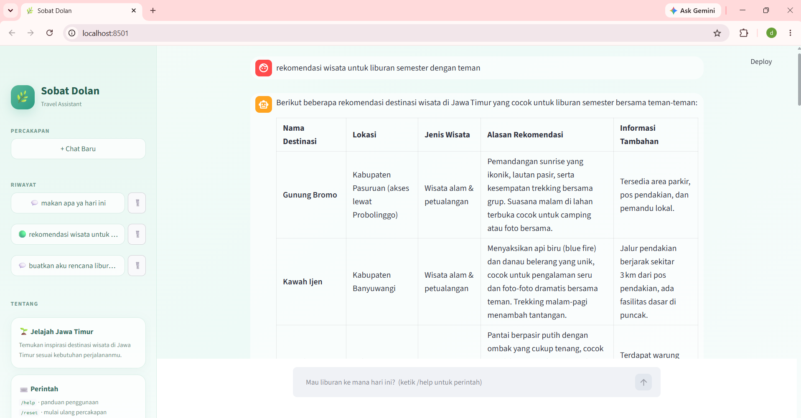
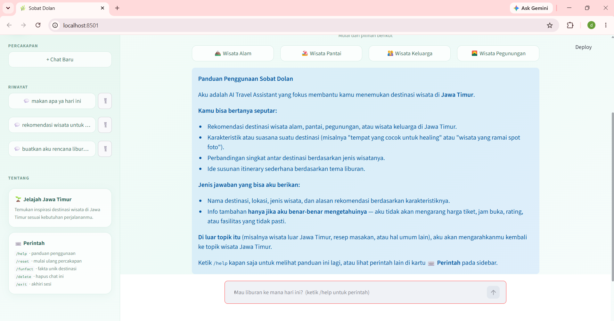
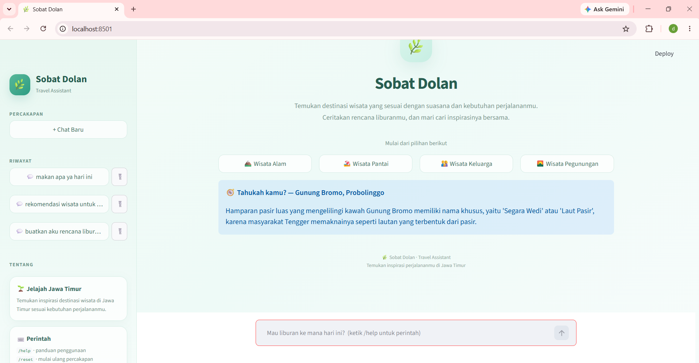
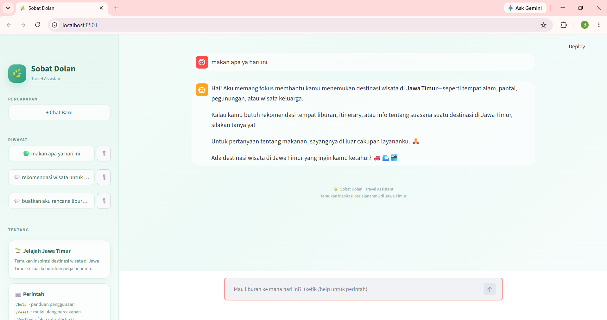
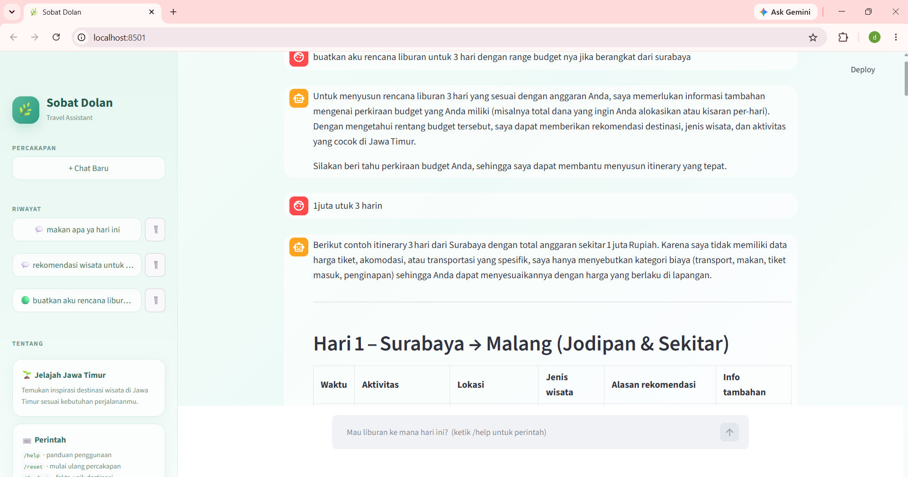
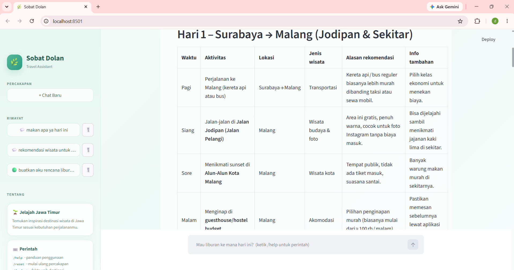
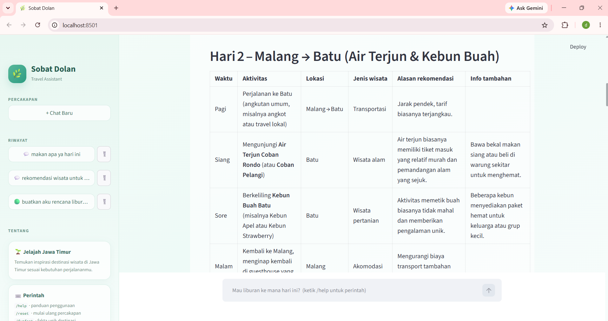

# Sobat Dolan - Travel Assistant Chatbot Jawa Timur
Sobat Dolan merupakan sebuah Chatbot AI sederhana yang dapat membantu anda untuk membantu pengguna menemukan inspirasi dan rekomendasi wisata di Jawa Timur.

Chatbot Sobat Dolan tidak hanya menyediakan rekomendasi, tetapi juga dapat diandalkan untuk menyusun rancangan itinerary dan rundown liburan. Selain itu, chatbot ini mampu menyajikan fakta-fakta unik yang jarang diketahui publik, serta memberikan berbagai informasi komprehensif lainnya seputar objek wisata di Jawa Timur. 

## Fitur Sobat Dolan:
* Rekomendasi destinasi wisata mulai dari alam hingga taman hiburan di Jawa Timur
* Menyimpan riwayat percakapan di lokal
* Pengelolaan percakapan melalui sidebar
* Tombol Quick Prompt di halaman awal


## Perintah yang tersedia
* /help	Menampilkan panduan penggunaan
* /reset Mulai ulang percakapan (yang lama tetap tersimpan)
* /funfact Menampilkan fakta unik acak seputar destinasi
* /delete Menghapus percakapan yang sedang dibuka
* /exit Menyimpan dan mengakhiri sesi

## Instalasi

### 1. Clone Repository

```bash
git clone https://github.com/dhananatasya/chatbot.git
```

Masuk ke folder project:

```bash
cd chatbot
```

### 2. Buat Virtual Environment

```bash
python -m venv venv
```

```bash
venv\Scripts\activate
```

### 3. Install Dependency

Install library yang dibutuhkan menggunakan:

```bash
pip install streamlit python-dotenv groq
```
Atau simpan sebagai requirements.txt:
streamlit
python-dotenv
groq

### 4. Buat file .env di folder yang sama dengan app.py
GROQ_API_KEY=isi_api_key_groq_kamu

## ▶️ Menjalankan Aplikasi

```bash
streamlit run app.py
```

Kemudian buka alamat yang diberikan oleh Streamlit pada browser.

Biasanya aplikasi dapat diakses melalui:

```text
http://localhost:8501
```

## 🔑 Mendapatkan Groq API Key

Aplikasi ini membutuhkan API key dari Groq agar bisa mengakses model bahasa. Berikut langkahnya:

1. Buka console.groq.com di browser.
2. Daftar atau masuk (login) menggunakan akun Google, GitHub, atau email.
3. Di menu sebelah kiri, buka halaman API Keys.
4. Klik Create API Key, lalu beri nama yang mudah diingat (misalnya sobat-dolan).
5. Salin API key yang muncul (biasanya diawali gsk_). Key ini umumnya hanya ditampilkan sekali, jadi simpan segera. Jika terlewat, buat key baru.
6. Tempel ke file .env di folder proyek, tanpa spasi dan tanpa tanda kutip:
   GROQ_API_KEY=gsk_xxxxxxxxxxxxxxxxxxxxxxxx

## Penjelasan Kode
### Struktur Project
Struktur utama chatbot Sobat Dolan: 
```
chatbot/
│
├── .env
├── .env.example
├── .gitignore
├── app.py
├── README.md
├── requirements.txt
├── chat_history
    └── .json
```
 ### app.py
 Berisi seluruh kode aplikasi yang terdapat konfigurasi model, system prompt chatbot, fungsi untuk membersihkan jawaban dan mengelola riwayatchat, kode CSS untuk tampilan chatbot, quick prompt, perintah-perintah khusus, serta proses bagaimana pesan dikirim ke Groq API.

### .env
Untuk menyimpan API Groq yang akan dibaca oleh python-dotenv saat chatbot dijalankan.

### requirements.txt 
Berisi daftar library yang digunakan seperti streamlit, python-dotenv dan groq.

### .gitignore 
Untuk menentukan file mana saja yang tidak ikut masuk ke dalam Git seperti .env, chat_history, dan pychace

### chat_history
Dibuat untuk menyimpan setiap percakapan dalam satu file JSON

### README.md
Digunakan untuk menyimpan dokumentasi pengembangan chatbot seperti deskripsi, cara menggunakan, cara menjalankan, penjelasan fitur-fitur, dan penjelasan lainnya.

## Contoh Capture Percakapan
Berikut merupakan tampilan contoh penggunaan chatbot Sobat Dolan

### Tampilan Awal Chatbot Sobat Dolan


### Chat Rekomendasi Wisata


### Menjalankan Perintah /help


### Menjalankan Perintah /funfact


### Chat di Luar Topik Rekomendasi Wisata


### Chat Menyediakan Rancangan Itinerary




## Penggunaan AI dalam Pengembangan Chatbot
Dalam pengerjaan chatbot Sobat Dolan, penggunaan bantuan AI digunakan pada tahap brainstorming tema chatbot serta pada perancangan dan pengembangan tampilan chatbot. Generative AI membantu dalam menentukan arah dan konsep chatbot sebagai asisten rekomendasi wisata Jawa Timur, kemudian membantu menyusun tampilan antarmuka agar terlihat rapi dan nyaman digunakan. 
Penambahan fitur perintah dan pembuatan readme juga dibantu oleh Generative AI guna meningkatkan kerapihan dalam menyusun struktur readme agar mudah dipahami setiap tahapannya. 
Seluruh hasil Generative AI telah diuji ulang dan disesuaikan dengan kebutuhan proyek.