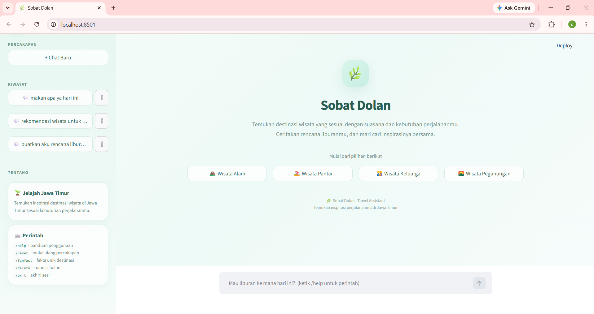

# Sobat Dolan - Travel Assistant Chatbot Jawa Timur
Sobat Dolan merupakan sebuah Chatbot AI sederhana yang dapat membantu anda untuk membantu pengguna menemukan inspirasi dan rekomendasi wisata di Jawa Timur.

Chatbot Sobat Dolan tidak hanya menyediakan rekomendasi, tetapi juga dapat diandalkan untuk menyusun rancangan itinerary dan rundown liburan. Selain itu, chatbot ini mampu menyajikan fakta-fakta unik yang jarang diketahui publik, serta memberikan berbagai informasi komprehensif lainnya seputar objek wisata di Jawa Timur. 

## Fitur Sobat Dolan:
* Rekomendasi destinasi wisata mulai dari alam hingga taman hiburan di Jawa Timur
* Menyimpan riwayat percakapan di lokal
* Pengelolaan percakapan melalui sidebar
* Tombol Quick Prompt di halaman awal


## Perintah yang tersedia
* /help	Menampilkan panduan penggunaan
* /reset Mulai ulang percakapan (yang lama tetap tersimpan)
* /funfact Menampilkan fakta unik acak seputar destinasi
* /delete Menghapus percakapan yang sedang dibuka
* /exit Menyimpan dan mengakhiri sesi

## 📂 Struktur Project
Struktur utama chatbot Sobat Dolan: 

chatbot/
│
├── .env
├── .env.example
├── .gitignore
├── app.py
├── README.md
├── requirements.txt
├── chat_history
    └── .json
```

## Instalasi

### 1. Clone Repository

```bash
git clone https://github.com/dhananatasya/chatbot.git
```

Masuk ke folder project:

```bash
cd chatbot
```

### 2. Buat Virtual Environment

```bash
python -m venv venv
```

```bash
venv\Scripts\activate
```

### 3. Install Dependency

Install library yang dibutuhkan menggunakan:

```bash
pip install streamlit python-dotenv groq
```
Atau simpan sebagai requirements.txt:
streamlit
python-dotenv
groq

### 4. Buat file .env di folder yang sama dengan app.py
GROQ_API_KEY=isi_api_key_groq_kamu

## ▶️ Menjalankan Aplikasi

```bash
streamlit run app.py
```

Kemudian buka alamat yang diberikan oleh Streamlit pada browser.

Biasanya aplikasi dapat diakses melalui:

```text
http://localhost:8501
```

## 🔑 Mendapatkan Groq API Key

Aplikasi ini membutuhkan API key dari Groq agar bisa mengakses model bahasa. Berikut langkahnya:

1. Buka console.groq.com di browser.
2. Daftar atau masuk (login) menggunakan akun Google, GitHub, atau email.
3. Di menu sebelah kiri, buka halaman API Keys.
4. Klik Create API Key, lalu beri nama yang mudah diingat (misalnya sobat-dolan).
5. Salin API key yang muncul (biasanya diawali gsk_). Key ini umumnya hanya ditampilkan sekali, jadi simpan segera. Jika terlewat, buat key baru.
6. Tempel ke file .env di folder proyek, tanpa spasi dan tanpa tanda kutip:
   GROQ_API_KEY=gsk_xxxxxxxxxxxxxxxxxxxxxxxx

## Contoh Capture Percakapan
Berikut merupakan tampilan contoh penggunaan chatbot Sobat Dolan

### Tampilan Awal Chatbot Sobat Dolan
